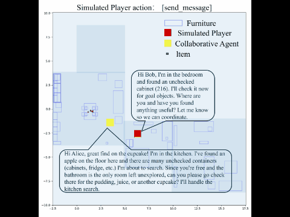
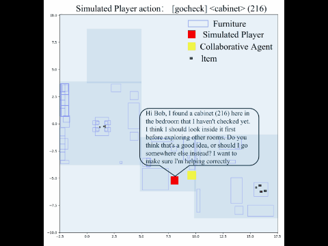
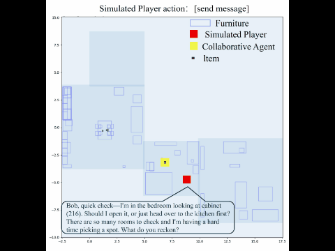
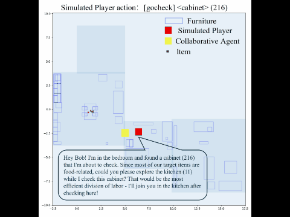
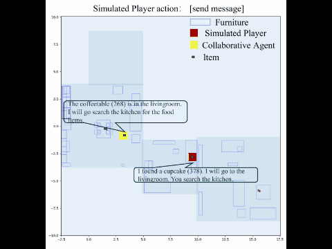

# 🚀 CollabBench

We propose **CollabBench**, a benchmark for **systematically evaluating and training LLM-based agents to proactively collaborate with diverse players**.

CollabBench focuses on collaborative agent research, aiming to facilitate research on LLM-based agents in **efficient and affective interactions**.

This repository is organized into the following **five sections**.

---

## 1️⃣ Diverse Player Profiles Simulation

```bash
cd Anthropomorphic
````

This section focuses on modeling **diverse player profiles** from trajectory data.

📄 **Details:** `Anthropomorphic/README.md`

---

## 2️⃣ Collaborative Agentic Training

This section describe the **training of the collaborative agents** for the two multi-player game environments.

```bash
cd Training
````

### 🎮 CWAH-MultiPlayer

```bash
cd CWAH-MultiPlayer
```

📄 **Details:** `CWAH-MultiPlayer/README.md`


### 🎮 Cook-MultiPlayer

```bash
cd Cook-MultiPlayer
```

📄 **Details:** `Cook-MultiPlayer/README.md`

---

## 3️⃣ Trajectory Collection

This section introduces the **trajectory rollout and data collection pipeline** for the two multi-player game environments.

```bash
cd Running
````

### 🎮 CWAH-MultiPlayer

```bash
cd CWAH-MultiPlayer
```

📄 **Details:** `CWAH-MultiPlayer/README.md`


### 🎮 Cook-MultiPlayer

```bash
cd Cook-MultiPlayer
```

📄 **Details:** `Cook-MultiPlayer/README.md`

---

## 4️⃣ Evaluation

This section describes the **affective evaluation protocols** used in CollabBench.

📄 **Details:** `Evaluation/README.md`

---

## 5️⃣ Player Trajectory Demonstration

We visualize representative trajectories for **five typical player types** (GIF format) to illustrate their collaboration behaviors.

### ❶ Efficient Collaboration Expert




### ❷ Hesitant Laggard




### ❸ Anxious Doubter




### ❹ Proactive Leader




### ❺ Independent Loner



